# Multi-UAV Adaptive Cooperative Formation Trajectory Planning Based on an Improved MATD3 Algorithm of Deep Reinforcement Learning

Xiaojun Xing , Zhiwei Zhou $\textcircled{1}$ , Yan Li , Bing Xiao , Member, IEEE, and Yilin Xun

Abstract—Multi-unmanned aerial vehicle (multi-UAV) cooperative trajectory planning is an extremely challenging issue in UAV research field due to its NP-hard characteristic, collision avoiding constraints, close formation requirement, consensus convergence and high-dimensional action space etc. Especially, the difficulty of multi-UAV trajectory planning will boost comparatively when there are complex obstacles and narrow passages in unknown environments. Accordingly, a novel multi-UAV adaptive cooperative formation trajectory planning approach is proposed in this article based on an improved deep reinforcement learning algorithm in unknown obstacle environments, which innovatively introduces long short-term memory (LSTM) recurrent neural network (RNN) into the environment perception end of multi-agent twin delayed deep deterministic policy gradient (MATD3) network, and develops an improved potential field-based dense reward function to strengthen the policy learning efficiency and accelerates the convergence respectively. Moreover, a hierarchical deep reinforcement learning training mechanism, including adaptive formation layer, trajectory planning layer and action execution layer is implemented to explore an optimal trajectory planning policy. Additionally, an adaptive formation maintaining and transformation strategy is presented for UAV swarm to comply with the environment with narrow passages. Simulation results show that the proposed approach is better in policy learning efficiency, optimality of trajectory planning policy and adaptability to narrow passages than that using multi-agent deep deterministic policy gradient (MADDPG) and MATD3.

Index Terms—Multi-unmanned aerial vehicle (multi-UAV) cooperative formation trajectory planning, deep reinforcement learning, potential field-based dense reward, adaptive formation strategy, hierarchical training mechanism.

Manuscript received 29 July 2023; revised 6 December 2023 and 31 January 2024; accepted 1 April 2024. Date of publication 16 April 2024; date of current version 19 September 2024. This work was supported in part by the National Natural Science Foundation of China under Grant 62273283, in part by Xi’an Science and Technology Plan Project under Grant 22GXFW0136, in part by the Industry-University-Research Innovation Fund of Chinese Universities under Grant 2021ZYA03006, in part by the Natural Science Basic Research Program of Shaanxi under Grant 2024JC-YBMS-500, and in part by Guangdong Basic and Applied Basic Research Foundation under Grant 2024A1515010674. The review of this article was coordinated by Prof. Xianbin Cao. (Corresponding author: Xiaojun Xing.)

Xiaojun Xing is with the School of Automation, Northwestern Polytechnical University, Xi’an 710129, China, and also with the Research and Development Institute, Northwestern Polytechnical University in Shenzhen, Shenzhen 518063, China (e-mail: xxiaojun@126.com).

Zhiwei Zhou, Yan Li, Bing Xiao, and Yilin Xun are with the School of Automation, Northwestern Polytechnical University, Xi’an 710129, China (e-mail: zhiweijou $@$ 163.com; 15303954990@163.com; xiaobing@nwpu.edu. cn; 458980052@qq.com).

# I. INTRODUCTION

C OMPARED with single unmanned aerial vehicle (UAV),the UAV formation can efficiently accomplish many challenging missions, multi-unmanned aerial vehicle (multi-UAV) cooperative formation trajectory planning is the focus of multiUAV formation control field at present. Trajectory planning is a NP-hard problem [1] with extremely high computational complexity that traditionally is solved by $\mathbf { A } ^ { * }$ , Rapid-exploration Random Tree (RRT), Dijkstra, Probabilistic Roadmap (PRM), Genetic Algorithm (GA), Ant Colony Optimization (ACO), Particle Swarm Optimization (PSO) and so on which mostly are used in simple environments.

With the rapid development of artificial intelligence, deep reinforcement learning, which is a machine learning approach that focuses on learning by interacting with an environment through trial and error, has a bright future in UAV trajectory planning [2], [3], [4], [5] because it is independent on prior knowledge and meets the real-time online requirements of multi-UAV formation trajectory planning and is ideal for decision-making control problems in unknown environments. Wang et al. [6] trained a multi-UAV trajectory planning policy by an Actor-Critic neural network with multi-resolution observations, but all UAVs were considered to belong to the same entity and implement the same policy. Xu et al. [7] studied multi-UAV trajectory for uplink data collection task based on a multi-agent deep reinforcement learning algorithm. Wang et al. [8] provided a multi-agent deep deterministic policy gradient (MADDPG) algorithm based trajectory control algorithm for managing the trajectory of each UAV independently. Chen et al. [9] applied MADDPG to UAV motion control in trajectory planning. Wei et al. [10] designed an incentive mechanism to ease the problem of sparse reward. In order to make better navigation and obstacle avoidance decisions, Singla et al. [11] presented a trajectory planning method based on recurrent neural network (RNN) architecture and temporal attention, whereas neglected multi-UAV formation obstacle avoidance. Challita et al. [12] formulated multi-UAV trajectory planning as a dynamic non-cooperative game and implemented a deep reinforcement learning algorithm based on echo state network (ESN) cells to solve the game. Wang et al. [13] offered a two-stage reinforcement learningbased multi-UAV collision avoidance approach without considering the policy differences between individual UAVs and the constraints of multi-UAV cooperative formation trajectory planning. Wang et al. [14] considered non-cooperative multiUAV scenarios for multi-UAV trajectory planning by use of a decentralized deep reinforcement learning approach in 2D grid-based maps, ignoring complex environments. To avoid ineffective action explorations and improve the convergence in deep reinforcement learning, Gong et al. [15] employed Bayesian optimization to estimate the UAVs’ flying decisions. For multiUAV coverage trajectory planning, Hu et al. [16] presented a distributed cooperative deep Q-learning (DCDQN) algorithm to obtain UAVs’ coverage trajectories online, neglecting the cooperative obstacle avoidance for multi-UAV formation. On the basis of DQN, Jiang et al. [17] proposed an effective reward mechanism that comprehensively considered changes in spacecraft orbit, improving the success rate of orbit interception in the environment with high uncertainty. Cao et al. [18] employed artificial potential field to guide a reverse-V multi-UAV formation navigation and obstacle avoidance, ignoring continuous actions and complex environments.

Although the previous studies had acquired numerous meaningful academic developments in multi-UAV formation trajectory planning, this topic still faces several pivotal challenges [19] as follows.

1) Trajectory planning should be effectively integrated with formation cooperation strategy in multi-UAV formation scenario to plan a reasonable optimal UAV swarm trajectory sets under constraints of formation cooperation. And a collision avoidance algorithm is essential [20].   
2) In reinforcement learning, reward plays a very important role in guiding agent to learn and optimize policies. A major challenge in real-world reinforcement learning is the sparse reward problem which means that the environment rarely produces a useful reward feedback signal and only indicates whether the task is completed partially or fully. The sparse reward problem severely influences the way ordinary reinforcement learning attempts to learn negatively, leads to lack of feedback, delayed reinforcement, exploration challenge and sparse gradient signals, slows down the convergence of algorithms [21], or even fails to find an acceptable policy within a reasonable time frame. Especially for the multi-UAV cooperative formation, the sparse reward problem is more typical and challenging. In this article, a potential field-based dense reward model is provided to solve the sparse reward problem.

3) The formation maintaining trajectory planning for UAV swarm can be generally solved by traditional algorithms only in simple static known environments which rely on prior knowledge and global map, suffer huge computational complexity, local optimal solution etc. On the contrary, reinforcement learning, as a model and environment independent algorithm, can more effectively handle the high-dimensional trajectory planning of UAV swarm in complex unknown uncertain dynamic environments without prior knowledge than the previous conventional algorithms. Particularly, when planning trajectory for UAV swarm in narrow passages with a width far smaller than the width of multi-UAV formation, it is indispensable to supplement a formation transformation strategy in reinforcement learning to dynamically change the formation to make the UAV swarm pass through the narrow passage safely. Nevertheless, it is quite difficult to exert existing multi-UAV trajectory planning methods to an unknown environment with narrow passages [22].

In order to cope with the foregoing issues, we propose a multi-UAV adaptive cooperative formation trajectory planning approach based on an improved multi-agent twin delayed deep deterministic policy gradient (MATD3) algorithm with deep reinforcement learning in this article. The significant contributions are as follows.

1) An improved MATD3 deep reinforcement learning algorithm is proposed to address the issue of multi-UAV trajectory planning in unknown environments where long short-term memory (LSTM) is introduced into the environment perception end of MATD3 network which develop an improved potential field-based dense reward function. To differentiate, the new algorithm is called potential field-LSTM-MATD3 (PF-LSTM-MATD3) in this article. Multi-UAV formation trajectory planning based on reinforcement learning is a typical Markov decision process (MDP) problem. Due to its ability to capture long term dependencies in sequential data, LSTM can assist UAVs in the formation to selectively learn the action sequences that have received certain rewards in the past based on historical data. Therefore, PF-LSTM-MATD3 performs well in approximating the probability function which is responsible for determining the motion strategy of the UAV swarm at any state and finding an optimal policy that maximizes the desired sum of rewards accumulated.

2) An adaptive formation maintaining model is developed to deal with the formation cooperation issue in multiUAV trajectory planning, and an adaptive formation transformation strategy is employed to conform to narrow passages.

# II. PROBLEM FORMULATION AND MODELING

In this section, the problem of multi-UAV formation trajectory planning in unknown environments is formulated. It is assumed that the multi-UAV formation, including three reconnaissance UAVs in this article, arrives at target region while maintaining desired mission formation as much as possible. Particularly, a virtual typical leader-follower structure topology [23], [24], where only one UAV is selected as a virtual leader UAV, and the others are follower UAVs, is deployed for the formation, and constraints such as unidentified obstacles, UAV performance, collisions between UAVs and formation strategies are considered. Subsequently, an adaptive formation maintaining model is established, and an adaptive formation transformation strategy is designed to adapt to narrow passages. In addition, an improved potential field-based dense reward function model is provided to speed up convergence.

For simplification, there are a couple of assumptions as follows.

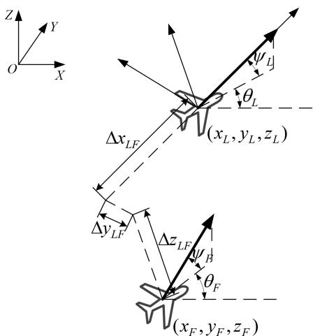  
Fig. 1. Schematic diagram of relative position between the virtual leader UAV and the follower UAV in an ideal situation.

# A. Assumptions

Assumption 1: The size of UAV and the aerodynamic interaction among UAVs are ignored. In this case, the kinematics equation of UAV in inertial coordinate system can be denoted as

$$
\left\{ \begin{array} { l l } { \dot { x } = v \cos \theta \cos \psi } \\ { \dot { y } = v \cos \theta \sin \psi } \\ { \dot { z } = v \sin \theta } \\ { \dot { v } = a ^ { v } } \\ { \dot { \theta } = \omega ^ { \theta } } \\ { \dot { \psi } = \omega ^ { \psi } } \end{array} \right.
$$

where $( x , y , z )$ is UAV position, $v , \theta , \psi , a ^ { v } , \omega ^ { \theta } , \omega ^ { \psi }$ represent ( )UAV velocity, pitch angle, yaw angle, linear acceleration, pitch angular acceleration, and yaw angular acceleration respectively.

Assumption 2: Obstacles are equivalent to standard convex bodies [25] envelop which is given by

$$
\Gamma ( P ) = \left( \frac { x - x _ { 0 } } { a } \right) ^ { 2 p } + \left( \frac { y - y _ { 0 } } { b } \right) ^ { 2 ^ { \circ } l } + \left( \frac { z - z _ { 0 } } { c } \right) ^ { 2 ^ { \circ } k }
$$

where $a , b , c$ determine the coverage ranges of obstacles, and $a , b , c > 0 ; p , l , k$ determine the shapes of obstacles, and $p , l , k >$ $0 ; [ x _ { 0 } , y _ { 0 } , z _ { 0 } ] ^ { T }$ represents the center of the obstacle. If $a = b = c$ [and $p = l = k$ , then obstacles are spheres. If $a = b$ and $p = l =$ $1 , k > 1$ =, then obstacles are cylinders.

# B. Adaptive Formation Maintaining Model

Multi-UAV adaptive formation maintaining in this article is essentially a tracking issue, that is, follower UAVs are supposed to track the trajectory of virtual leader UAV and arrive at the corresponding desired target location. The relative position relationship between the follower UAV and virtual leader UAV is shown in Fig. 1 where $\theta _ { L }$ and $\psi _ { L }$ are the pitch and yaw angles of the virtual leader UAV respectively, $\theta _ { F }$ and $\psi _ { F }$ are the pitch and yaw angles of the follower UAV respectively, $\left( x _ { L } , y _ { L } , z _ { L } \right)$ is the position of the virtual leader UAV, $\left( x _ { F } , y _ { F } , z _ { F } \right)$ )is the position of the follower UAV, $( \Delta x _ { L F } , \Delta y _ { L F } , \Delta z _ { L F } )$ )is the desired distance (Δ Δ Δ )between the virtual leader UAV and the follower UAV.

As shown in Fig. 1, based on Assumption 1, take the virtual leader UAV as a reference point or origin of body coordinate system, then the ideal geometrical relative position between the virtual leader UAV and the follower UAV is

$$
\begin{array} { r } { \Big [ \mathop { x } _ { L } \Big ] = \ \bigg [ \mathop { y } _ { F } \bigg ] + T _ { 1 } ( \psi _ { L } ) T _ { 2 } ( \theta _ { L } ) \ \bigg [ \Delta { y } _ { L F } } \\ { z _ { L } \Big ] = \ \bigg [ z _ { F } \bigg ] \quad \quad \quad \quad \quad \quad \quad \quad \quad \quad \quad \quad \quad \quad \quad \quad } \end{array}
$$

where $T _ { 1 } ( \psi _ { L } )$ and $T _ { 2 } ( \boldsymbol { \theta } _ { L } )$ are given by (4) and (5) respectively.

$$
\begin{array} { r l } & { T _ { 1 } ( \psi _ { L } ) = \left[ \begin{array} { c c c } { \cos \psi _ { L } } & { - \sin \psi _ { L } } & { 0 } \\ { \sin \psi _ { L } } & { \cos \psi _ { L } } & { 0 } \\ { 0 } & { 0 } & { 1 } \end{array} \right] } \\ & { T _ { 2 } ( \theta _ { L } ) = \left[ \begin{array} { c c c } { \cos \theta _ { L } } & { 0 } & { \sin \theta _ { L } } \\ { 0 } & { 1 } & { 0 } \\ { - \sin \theta _ { L } } & { 0 } & { \cos \theta _ { L } } \end{array} \right] } \end{array}
$$

Due to the inner and outer disturbances during practical formation maintaining flight process, the real positions of the virtual leader UAV and follower UAV are different from the ideal positions shown in (3), accordingly, the real relative distance between the virtual leader UAV and the follower UAV is biased. So, taking the deviation into account, we rewrite (3) as follows:

$$
E = \left[ \begin{array} { l } { x _ { L } - x _ { F } } \\ { y _ { L } - y _ { F } } \\ { z _ { L } - z _ { F } } \end{array} \right] - T _ { 1 } ( \psi _ { L } ) T _ { 2 } ( \theta _ { L } ) \left[ \begin{array} { l } { \Delta \hat { x } } \\ { \Delta \hat { y } } \\ { \Delta \hat { z } } \end{array} \right]
$$

where $E$ is the error of formation distance, $( \Delta \hat { x } , \Delta \hat { y } , \Delta \hat { z } )$ is the (Δˆ Δˆ Δˆ)actual distance between the virtual leader UAV and the follower UAV.

Let $\delta = \left[ \begin{array} { l } { \Delta \hat { x } } \\ { \Delta \hat { y } } \\ { \Delta \hat { z } } \end{array} \right]$ , then the second-order derivative of (6) is

$$
\begin{array} { r } { \ddot { E } = [ \ddot { \bar { x } } _ { L } - \ddot { \bar { x } } _ { F } ] - \ddot { T } _ { 1 } ( \psi _ { L } ) T _ { 2 } ( \theta _ { L } ) \delta \dot { \psi } _ { L } ^ { 2 } - \dot { T } _ { 1 } ( \psi _ { L } ) T _ { 2 } ( \theta _ { L } ) \delta \ddot { \psi } _ { L } } \\ { \ddot { z } _ { L } - \ddot { z } _ { F } ] } \\ { - 2 \dot { T } _ { 1 } ( \psi _ { L } ) \dot { T } _ { 2 } ( \theta _ { L } ) \delta \dot { \psi } _ { L } \dot { \theta } _ { L } } \\ { - T _ { 1 } ( \psi _ { L } ) \ddot { T } _ { 2 } ( \theta _ { L } ) \delta \dot { \theta } _ { L } ^ { 2 } - T _ { 1 } ( \psi _ { L } ) \dot { T } _ { 2 } ( \theta _ { L } ) \delta \ddot { \theta } _ { L } \quad \quad \quad \quad \quad \quad \quad \quad \quad \quad \quad \quad \quad \quad \quad } \end{array}
$$

It can be calculated from (1) that

$$
\left\{ \begin{array} { l } { \ddot { x } _ { i } = a _ { i } ^ { v } \cos \theta _ { i } \cos \psi _ { i } - w _ { i } ^ { \theta } v _ { i } \sin \theta _ { i } \cos \psi _ { i } - w _ { i } ^ { \psi } v _ { i } \cos \theta _ { i } \sin \psi _ { i } } \\ { \ddot { y } _ { i } = a _ { i } ^ { v } \cos \theta _ { i } \sin \psi _ { i } - w _ { i } ^ { \theta } v _ { i } \sin \theta _ { i } \sin \psi _ { i } + w _ { i } ^ { \psi } v _ { i } \cos \theta _ { i } \cos \psi _ { i } } \\ { \qquad \ddot { z } _ { i } = a _ { i } ^ { v } \sin \theta _ { i } + w _ { i } ^ { \theta } v _ { i } \cos \theta _ { i } } \end{array} \right.
$$

where $i = L , F$ , represent the virtual leader UAV and the fol=lower UAV.

$\begin{array} { r } { u = [ a _ { F } ^ { v } \quad \omega _ { F } ^ { \theta } \quad \omega _ { F } ^ { \psi } ] ^ { T } } \end{array}$ is selected as the control variable, where $a _ { F } ^ { v }$ is acceleration, $\omega _ { F } ^ { \theta }$ is pitch angular acceleration, and $\omega _ { F } ^ { \psi }$ is yaw angular acceleration. Substituting (8) into (7), then

$$
\ddot { E } = F + K u
$$

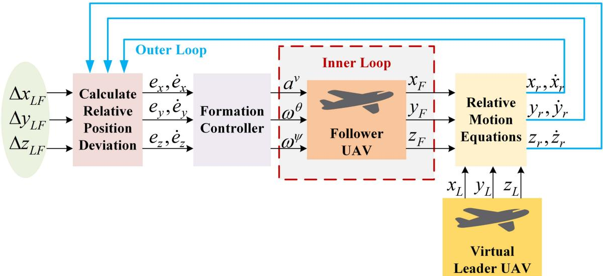  
Fig. 2. Schematic diagram of the follower UAV swarm formation controller.

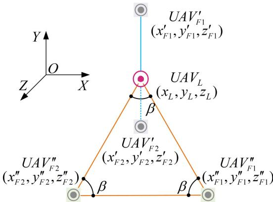  
Fig. 3. Schematic diagram of virtual leader-follower structure coordinate system.

where $F = [ \mu _ { x } \quad \mu _ { y } \quad \mu _ { z } ] ^ { T }$ is the component of $\ddot { E }$ other than = [ ]the control variable in the $x y z$ -axis, and $K$ is given by

$$
K = \left[ \begin{array} { c c c c } { - \cos \theta _ { F } \cos \psi _ { F } } & { v _ { F } \sin \theta _ { F } \cos \psi _ { F } } & { v _ { F } \cos \theta _ { F } \sin \psi _ { F } } \\ { - \cos \theta _ { F } \sin \psi _ { F } } & { v _ { F } \sin \theta _ { F } \sin \psi _ { F } } & { - v _ { F } \cos \theta _ { F } \cos \psi _ { F } } \\ { - \sin \theta _ { F } } & { - v _ { F } \cos \theta _ { F } } & { 0 } \end{array} \right]
$$

Obviously, $E$ should approach to zero by use of formation controller to ensure that UAV swarm can maintain the ideal formation without position deviation in real flight scenario.

# C. Sliding Mode Controller for Formation Maintaining of the Follower UAV

In this article, we focus on trajectory planning for UAV swarm formation maintaining. Limited to the page number, in this part we just give a brief introduction of formation controller based on sliding mode control (SMC) [26], [27], which we have developed in literature [28], please refer to literature [28] for more details.

The schematic diagram of follower UAV formation controller based on leader-follower style is given in Fig. 2, where $( x _ { r } , y _ { r } , z _ { r } )$ is the relative position between the virtual leader

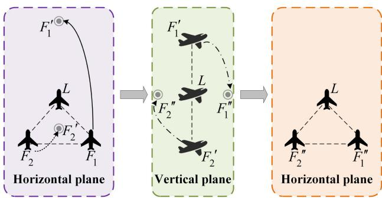  
Fig. 4. Schematic diagram of multi-UAV adaptive formation transformation strategy.

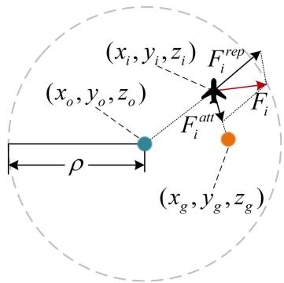  
Fig. 5. Schematic diagram of the attraction mechanism and repulsion mechanism.

UAV and follower UAV, $( e _ { x } , e _ { y } , e _ { z } )$ is the deviation of formation distance.

Actually, the formation controller, whose outputs $a ^ { v } , \omega ^ { \theta } , \omega ^ { \psi }$ are command inputs of follower UAV flight controller, locates in the outer loop of follower UAV flight controller, as shown in Fig. 2. The follower UAV SMC formation controller is used to narrow the deviation between the ideal position and real position of the follower UAV to maintain the UAVs formation.

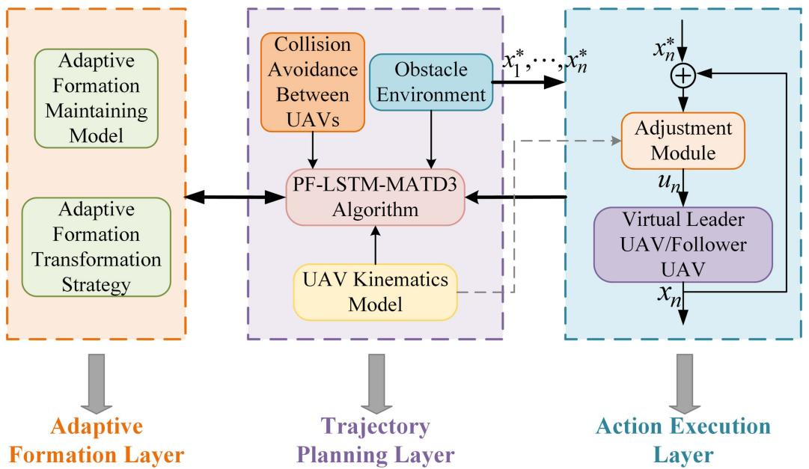  
Fig. 6. Hierarchical framework for multi-UAV formation.

According to the mathematical model of continuous sliding mode control, the sliding mode function is selected as

$$
s = H E + \dot { E } = \Bigg [ s _ { x } \Bigg ]
$$

where $H = \left[ h _ { x } \quad h _ { y } \quad h _ { z } \right]$ is the weight coefficient, $H > 0$ . =Obviously, if $s$ ]approaches zero in finite time, then $E$ approaches zero in finite time. In order to weaken the chattering of SMC and strengthen the robustness of SMC, an improved exponential approach law is given by

$$
\dot { s } = - \frac { \varepsilon } { \lambda + ( 1 - \lambda ) e ^ { - | s | } } | s | ^ { \gamma } \mathrm { s g n } ( s ) - k s
$$

where $\begin{array} { r } { \varepsilon = \left[ \varepsilon _ { x } \quad \varepsilon _ { y } \quad \varepsilon _ { z } \right] } \end{array}$ , $\varepsilon > 0$ , $0 < \lambda < 1$ , $0 < \gamma < 1$ , $k > 0$ = [ ]According to (11) and (12), then

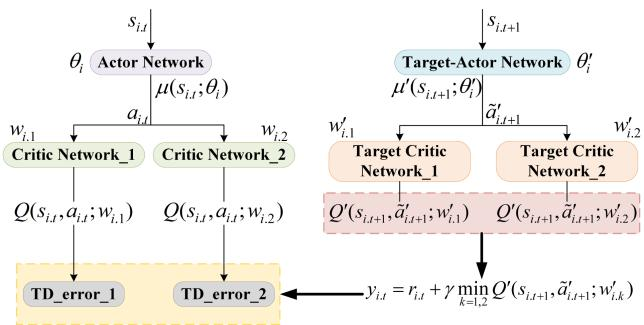  
Fig. 7. Network structure of a single agent in MATD3.

Therefore, the SMC formation controller is stable.

$$
H \dot { E } + \ddot { E } = - \frac { \varepsilon } { \lambda + ( 1 - \lambda ) e ^ { - | s | } } | s | ^ { \gamma } \mathrm { s g n } ( s ) - k s
$$

Substituting (9) into (13), then the control law of the sliding mode controller using the improved exponential approach law is

$$
u = K ^ { - 1 } \left( - \frac { \varepsilon } { \lambda + ( 1 - \lambda ) e ^ { - | s | } } | s | ^ { \gamma } \mathrm { s g n } ( s ) - k s - F - H \dot { E } \right) .
$$

To prove the stability of the control law in (14), the Lyapunov function is defined as

$$
V = { \frac { 1 } { 2 } } s ^ { 2 }
$$

The first-order derivative of (15) is

$$
\dot { V } = s \dot { s }
$$

Substituting (12) into (16), then

$$
\dot { V } = s \dot { s } = - \frac { \varepsilon s } { \lambda + ( 1 - \lambda ) e ^ { - | s | } } | s | ^ { \gamma } \mathrm { s g n } ( s ) - k s ^ { 2 } < 0
$$

# D. Adaptive Formation Transformation Strategy

When planning trajectory for multi-UAV formation, the position of virtual leader UAV is determined at first, then a suitable UAV formation, depending on the mission environment, is selected, finally the desired positions of corresponding follower UAVs are calculated by (3). The virtual leader-follower structure coordinate system is illustrated in Fig. 3, where $\beta = 6 0 ^ { \circ }$ , $\left( x _ { L } , y _ { L } , z _ { L } \right)$ is the position of virtual leader UAV $( U A V _ { L } )$ , $( x _ { F 1 } ^ { \prime } , y _ { F 1 } ^ { \prime } , z _ { F 1 } ^ { \prime } )$ and $( x _ { F 2 } ^ { \prime } , y _ { F 2 } ^ { \prime } , z _ { F 2 } ^ { \prime } )$ are the desired positions (in vertical plane) of follower UAVs $( U A V _ { F 1 } , U A V _ { F 2 } )$ in linear formation, $( x _ { F 1 } ^ { \prime \prime } , y _ { F 1 } ^ { \prime \prime } , z _ { F 1 } ^ { \prime \prime } )$ and $( x _ { F 2 } ^ { \prime \prime } , y _ { F 2 } ^ { \prime \prime } , z _ { F 2 } ^ { \prime \prime } )$ are the desired ( ) ( )positions (in horizontal plane) of follower UAVs in triangular formation.

According to Assumption 2, the horizontal planes of all obstacles in the flight environment are circles. $O b s _ { 1 }$ and $O b s _ { 2 }$ are obstacles nearest to $U A V _ { L }$ . $R _ { o b s } ^ { 1 }$ , R2obs are radii of $O b s _ { 1 }$ and $O b s _ { 2 }$ whose heights are identical to $U A V _ { L }$ respectively. The width of linear formation is neglected, whereas the width of triangular formation is denoted as

$$
d _ { t } = \sqrt { \left( x _ { F 1 } - x _ { F 2 } \right) ^ { 2 } + \left( y _ { F 1 } - y _ { F 2 } \right) ^ { 2 } + \left( z _ { F 1 } - z _ { F 2 } \right) ^ { 2 } }
$$

where $\left( x _ { F 1 } , y _ { F 1 } , z _ { F 1 } \right)$ and $\left( x _ { F 2 } , y _ { F 2 } , z _ { F 2 } \right)$ are the positions of $U A V _ { F 1 }$ and $U A V _ { F 2 }$ ) (respectively.

The distance between the centers $( O _ { o b s } ^ { 1 } , O _ { o b s } ^ { 2 } )$ of $O b s _ { 1 }$ and $O b s _ { 2 }$ whose height is identical to $U A V _ { L }$ , is

$$
d _ { o b s } = \sqrt { \left( x _ { o 1 } - x _ { o 2 } \right) ^ { 2 } + \left( y _ { o 1 } - y _ { o 2 } \right) ^ { 2 } + \left( z _ { o 1 } - z _ { o 2 } \right) ^ { 2 } }
$$

where $\left( x _ { o 1 } , y _ { o 1 } , z _ { o 1 } \right)$ and $( x _ { o 2 } , y _ { o 2 } , z _ { o 2 } )$ are the positions of $O _ { o b s } ^ { 1 }$ and $O _ { o b s } ^ { 2 }$ )respectively.

$d _ { 0 }$ is the safe distance for UAV motion. When

$$
d _ { t } < d _ { o b s } - R _ { o b s } ^ { 1 } - R _ { o b s } ^ { 2 } - 2 d _ { 0 }
$$

the triangular formation transforms into a linear formation in time to traverse the narrow passage between $O b s _ { 1 }$ and $O b s _ { 2 }$ .

The schematic diagram of multi-UAV adaptive formation transformation strategy is represented in Fig. 4. $L$ is the position of $J A V _ { L } . \ F _ { 1 } ^ { \prime } , \ F _ { 2 } ^ { \prime } , \ F _ { 1 } ^ { \prime \prime }$ and $F _ { 2 } ^ { \prime \prime }$ are the desired positions of $U A V _ { F 1 }$ and $U A V _ { F 2 }$ , which are calculated according to (3) during formation transformation. The UAV swarm should maintain a triangular formation as much as possible to extend the reconnaissance range. To ensure flight safety, it is critical to transform into a linear formation as soon as a narrow passage is identified, and guide follower UAVs to their desired locations $( F _ { 1 } ^ { \prime } , F _ { 2 } ^ { \prime } )$ . A triangular formation should be restored in time once the linear formation securely passes through the narrow passage. Follower UAVs are guided to $F _ { 1 } ^ { \prime \prime }$ and $F _ { 2 } ^ { \prime \prime }$ .

# E. Potential Field-Based Dense Reward Model

In reinforcement learning, it is essential to develop a proper reward function when making decisions based on observed environmental data so that UAVs can evaluate the quality of their actions [29]. Obviously, the reward is a reinforcement signal that drives UAVs move toward the target while avoiding obstacles. Traditional reinforcement learning employs sparse reward functions, which results in a lack of continuous reward guidance for UAVs and slow convergence during training.

Since the attraction and repulsion in potential field are continuous and dense, a dense reward model is presented, in which an attraction mechanism and a repulsion mechanism are exerted, as shown in Fig. 5. Note that $( x _ { i } , y _ { i } , z _ { i } )$ is the position of one UAV in the formation, $( x _ { g } , y _ { g } , z _ { g } )$ )is the position of the target region, $( x _ { o } , y _ { o } , z _ { o } )$ ( )is the position of the obstacle or another ( )UAV (for one UAV in the formation, the others are considered as obstacles in this article), $F _ { i } ^ { a t t }$ is the attraction from the target region, $F _ { i } ^ { r e p }$ is the repulsion from the obstacle or another UAV, $F _ { i }$ is the resultant force, and $\rho$ is the range of repulsion from the obstacle or another UAV.

Moreover, there are two particular cases as follows.

1) Case 1: When the obstacle is located between the UAV and the target, and the attraction of the target is much larger than the repulsion of the obstacle, the UAV would be guided to collide with the obstacle.

2) Case 2: When there are multiple obstacles in a very close range to the target, it would cause the repulsion to be greater than the attraction, which may make it difficult for the UAV to reach the target.

The attraction mechanism-based dense reward between UAV and target at each time step is described as

$$
R _ { u g } = \left\{ \begin{array} { l l } { C _ { 1 } \beta \chi e ^ { - d ( p _ { u } , p _ { g } ) } , d ( p _ { u } , p _ { g } ) > \rho } \\ { C _ { 1 } \chi e ^ { - d ( p _ { u } , p _ { g } ) } , 0 < d ( p _ { u } , p _ { g } ) \le \rho } \\ { C _ { 1 } , d ( p _ { u } , p _ { g } ) = 0 } \end{array} \right.
$$

where $\beta \in ( 0 , 1 )$ is attractive strength adjustment coefficient, $\chi \in ( 0 , 1 )$ is attraction mechanism-based dense reward gain ( )coefficient, $d ( p _ { u } , p _ { g } )$ is the distance between UAV and target, and $C _ { 1 }$ ( )is a constant. The introduction of $\beta$ , $\chi$ and exponential representation is to quickly alleviate the attraction of target to UAV in Case $^ { l }$ .

The repulsion mechanism-based dense reward between UAV and obstacle at each time step is defined as

$$
R _ { u o } = \left\{ \begin{array} { l l } { 0 , d ( p _ { u } , p _ { o } ) \geq d _ { 0 } } \\ { - \eta [ \frac { 1 } { d ( p _ { u } , p _ { o } ) } - \frac { 1 } { d _ { 0 } } ] ^ { 2 } d ^ { \frac { 1 } { t } } ( p _ { u } , p _ { g } ) , 0 < d ( p _ { u } , p _ { o } ) < d _ { 0 } } \\ { - C _ { 2 } , d ( p _ { u } , p _ { o } ) = 0 } \end{array} \right.
$$

where $\eta \in ( 0 , 1 )$ is repulsive strength adjustment coefficient, $t \in ( 0 , 1 )$ ( )is adaptation coefficient, $d ( p _ { u } , p _ { o } )$ is the distance ( )between UAV and obstacle, $d ( p _ { u } , p _ { g } )$ ( )is the distance between UAV and target, $d _ { 0 }$ ( )is the safe distance for UAV motion, and $C _ { 2 }$ is a constant. The introduction of $\eta$ , $t$ and reciprocal expression is to quickly alleviate the repulsion of obstacle to UAV in Case 2.

The repulsion mechanism-based dense reward between UAVs at each time step is given by

$$
R _ { u u } = \left\{ { - \varphi ( e ^ { d _ { 0 } } - e ^ { d ( p _ { i } , p _ { j } ) } ) , 0 < d ( p _ { i } , p _ { j } ) < d _ { 0 } } \right.
$$

where $i , j \in \{ 1 , 2 , 3 \}$ , $\varphi \in ( 0 , 1 )$ is repulsive strength adjustment coefficient, $d ( p _ { i } , p _ { j } )$ ( )is the distance between UAVs, and $C _ { 3 }$ ( )is a constant. The introduction of $\varphi$ and exponential representation is to quickly alleviate the repulsion of obstacle to UAV in Case 2.

Combining (21), (22), and (23), the sum of dense rewards at each time step is

$$
R _ { s u m } = w _ { 1 } R _ { u g } + w _ { 2 } R _ { u o } + w _ { 3 } R _ { u u }
$$

where $w _ { i } ( i = 1 , 2 , 3 )$ is the weight coefficient of corresponding ( = )dense reward after normalization.

# III. PF-LSTM-MATD3-BASED MULTI-UAV ADAPTIVE FORMATION TRAJECTORY PLANNING

As shown in Fig. 6, a hierarchical framework is built to handle the problem formulated in Section II. The adaptive formation maintaining model and adaptive formation transformation strategy in Section II are both contained in the adaptive formation layer. In the trajectory planning layer, based on PF-LSTMMATD3 algorithm, the policies (e.g., velocity, and angular velocity) of the virtual leader UAV and follower UAVs are generated under the constraints of UAV kinematics model, obstacle environment, collision avoidance between UAVs, and formation cooperation information (e.g., the formation pattern which is linear or triangular, the position of virtual leader UAV, and the desired positions of follower UAVs) from adaptive formation layer. In the action execution layer, the policies established in trajectory planning layer are fed into the UAV’s adjustment module, which drives the virtual leader UAV and the follower UAVs to execute corresponding actions under the constraints of kinematics model. Meantime, the states after action execution are fed into the trajectory planning layer’s PF-LSTM-MATD3 algorithm module.

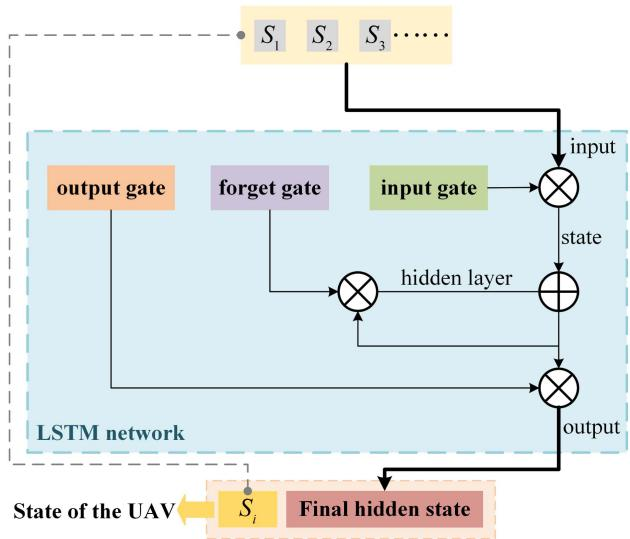  
Fig. 8. Environment perception model based on LSTM.

# A. State Space and Action Space

The state space of virtual leader UAV $( U A V _ { L } )$ is defined as

$$
S _ { L } = \left[ P _ { L } , \theta _ { L } , \psi _ { L } , P _ { L O } ^ { 1 } , P _ { L O } ^ { 2 } , R _ { o b s } ^ { 1 } , R _ { o b s } ^ { 2 } \right]
$$

where $P _ { L } = [ x _ { L } , y _ { L } , z _ { L } ]$ is three-dimensional position; $P _ { L O } ^ { 1 } =$ $[ x _ { L O } ^ { 1 } , y _ { L O } ^ { 1 } , z _ { L O } ^ { 1 } ]$ and $P _ { L O } ^ { 2 } = [ x _ { L O } ^ { 2 } , y _ { L O } ^ { 2 } , z _ { L O } ^ { 2 } ]$ =are relative three[ ] = [ ]dimensional positions of the two obstacles nearest to $U A V _ { L }$ respectively; $R _ { o b s } ^ { 1 }$ and $R _ { o b s } ^ { 2 }$ are radii of the obstacles nearest to $U A V _ { L }$ respectively.

The state space of follower UAV $( U A V _ { F m } , m = 1 , 2 )$ is given by

$$
S _ { F m } = [ P _ { F m } , \theta _ { F m } , \psi _ { F m } , P _ { F m } ^ { O 1 } , P _ { F m } ^ { O 2 } , P _ { F m } ^ { L } , P _ { F m } ^ { * } ]
$$

where $P _ { F m } = [ x _ { F m } , y _ { F m } , z _ { F m } ]$ is three-dimensional posi$\theta _ { F m }$ $\psi _ { F m }$ pitchand ely;are $P _ { F m } ^ { O 1 } = [ x _ { F m } ^ { 1 } , y _ { F m } ^ { 1 } , z _ { F m } ^ { 1 } ]$ $P _ { F m } ^ { O 2 } = [ x _ { F m } ^ { 2 } , y _ { F m } ^ { 2 } , z _ { F m } ^ { 2 } ]$ = [ ] = [ ]relative three-dimensional positions of the two obstacles nearest to $U A V _ { F m }$ respectively; $P _ { F m } ^ { L } = [ x _ { F m } ^ { L } , y _ { F m } ^ { L } , z _ { F m } ^ { L } ]$ is relative Fm  Fm three-dimensional position of $U A V _ { F m }$ Fmand $U A V _ { L }$ ; $P _ { F m } ^ { * } =$ $[ x _ { F m } ^ { * } , y _ { F m } ^ { * } , z _ { F m } ^ { * } ]$ =is relative three-dimensional position of $U A V _ { F m }$ ]and another follower UAV.

  
Fig. 9. Structure of PF-LSTM-MATD3 network.

Moreover, a continuous action space for UAVs is as follows.

$$
A = [ a ^ { v } , \omega ^ { \theta } , \omega ^ { \psi } ]
$$

where $a ^ { v }$ is acceleration, $\omega ^ { \theta }$ is pitch angular acceleration, and $\omega ^ { \psi }$ is yaw angular acceleration.

# B. Introduction of LSTM

LSTM is a type of RNN specially designed to prevent the neural network output for a given input from either decaying or exploding as it cycles through the feedback loops. The feedback loops allow recurrent networks to be better at pattern recognition than other neural networks. Memory of historical input is critical for solving sequence learning tasks and LSTM networks provide better performance compared to other RNN architectures by alleviating what is called gradient vanishing.

LSTM introduces three RNN-based gating mechanisms: forget gate, input gate and output gate. The computational burden [30] is eased by the gating mechanisms which judge, adjust and update data at each moment to determine the retention of input.

# C. Features of PF-LSTM-MATD3

Multi-agent reinforcement learning can be described as a tuple

$$
( n , S , O , A , T , \gamma , R )
$$

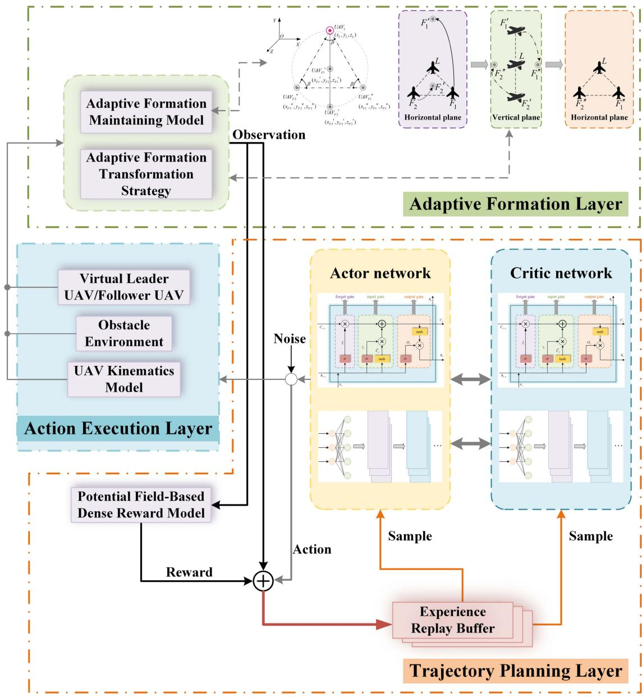  
Fig. 10. Hierarchical PF-LSTM-MATD3 training mechanism for multi-UAV adaptive cooperative formation trajectory planning.

where $n$ is the number of UAVs in the environment, $S$ is the finite set of environment states, $O = [ O _ { 1 } , O _ { 2 } , \dots , O _ { n } ]$ is the finite set of joint observations, $A = [ A _ { 1 } , A _ { 2 } , \ldots , A _ { n } ]$ ]is the finite set of = [actions available to each UAV, $T$ ]is the state transition probability function, $\gamma$ is the discount coefficient, and $R$ is the joint reward.

Due to its ability to capture long term dependencies in sequential data, LSTM can assist agents to selectively learn the action sequences that have received certain rewards in the past based on historical data. Consequently, LSTM could be integrated into multi-agent reinforcement learning algorithms to retain historical data of actions and environment feedback in this article. And more historical data retained by LSTM is so essential that it can assist UAVs in the formation to learn the characteristics of the environment faster for more rewards and guarantee the safe passage of UAVs through narrow passages in time. Likewise, C. Wang et al. [31] developed a deep reinforcement learning framework for UAV navigation in large-scale complex environments, in which the actor and critic in deep reinforcement learning are approximated by two LSTMs summarizing information encoded in historical trajectories. Due to deep Q-network (DQN) cannot efficiently learn the optimal scheduling policy for large-scale UAV-assisted networks, Ferdowsi et al. [32] developed an LSTM autoencoder to learn a better policy. Gao et al. [33] combined a LSTM network-based encoder with the deep deterministic policy gradient (DDPG) algorithm to perceive an unspecified number of dynamic obstacles. Based on explainable deep reinforcement learning, Hickling et al. [34] presented a detector with a LSTM network for faster UAV guidance.

At present, one of the most popular deep reinforcement learning algorithms is twin deep delayed deterministic policy gradient (TD3). The problems of value function overestimation and error accumulation in MADDPG are resolved by MATD3, which extends the TD3 algorithm to a multi-agent scenario. The network structure of a single agent in MATD3 is shown in Fig. 7. There are six networks in the structure of each agent, which are current actor network $\mu ( s _ { i . t } ; \theta _ { i } )$ , target actor network $\mu ^ { \prime } ( s _ { i . t + 1 } ; \theta _ { i } ^ { \prime } )$ , cur( ;rent critic network-1 $Q ( s _ { i . t } , a _ { i . t } ; w _ { i . 1 } )$ ( ; ), current critic network-2 $Q ( s _ { i . t } , a _ { i . t } ; w _ { i . 2 } )$ ( ; ), target critic network-1 $Q ^ { \prime } ( s _ { i . t + 1 } , \tilde { a } _ { i . t + 1 } ^ { \prime } ; w _ { i . 1 } ^ { \prime } )$ ( ; )and target critic network-2 $Q ^ { \prime } ( s _ { i . t + 1 } , \tilde { a } _ { i . t + 1 } ^ { \prime } ; w _ { i . 2 } ^ { \prime } )$ ˜ ; ). The actor ( ˜ ; )network employs a decentralized execution approach to input the state $s _ { i , t }$ and output the action $a _ { i , t }$ . The two critic networks adopt a centralized training approach, where the input includes not only the local state and action of the agent itself, but also the state and action of other agents, and the output is the Q-value of two approximate truth values. To avoid overestimation, the target value is calculated and updated with the minimum value between $Q ^ { \prime } ( s _ { i . t + 1 } , \tilde { a } _ { i . t + 1 } ^ { \prime } ; w _ { i . 1 } ^ { \prime } )$ and $Q ^ { \prime } ( s _ { i . t + 1 } , \tilde { a } _ { i . t + 1 } ^ { \prime } ; w _ { i . 2 } ^ { \prime } )$ .

TABLE I HYPER-PARAMETERS OF MADDPG, MATD3 AND PF-LSTM-MATD3   

<html><body><table><tr><td>Parameter</td><td>Value</td></tr><tr><td>Maximum episode Maximum step of an episode</td><td>3000 200</td></tr><tr><td>Experience replay buffer size</td><td>1000000</td></tr><tr><td>Batch size</td><td>512</td></tr><tr><td>Discount factor</td><td>0.98</td></tr><tr><td>Learning rate for actor network</td><td>0.001</td></tr><tr><td>Learning rate for critic network</td><td>0.001</td></tr><tr><td>Variance of the exploration noise</td><td>0.2</td></tr><tr><td>Optimizer</td><td>Adam</td></tr><tr><td>Delayed policy update interval (MATD3/PF-LSTM-MATD3)</td><td>2</td></tr></table></body></html>

TABLE II SETTINGS OF THE MULTI-UAV FORMATION   

<html><body><table><tr><td>UAV</td><td>Starting position (km)</td><td>Target position (km)</td></tr><tr><td>UAVF1</td><td>(1,7,1)</td><td>(8,3,1.5)</td></tr><tr><td>UAVL</td><td>(2,7,1)</td><td>(9,3,1.5)</td></tr><tr><td>UAVF2</td><td>(1.5,7.866,1)</td><td>(8.5,3.866,1.5)</td></tr></table></body></html>

( ˜ ; ) ( ˜ ; )For PF-LSTM-MATD3 network, there are two optimization measures offered in this article based on MATD3. One is to design a new reward function according to the potential fieldbased dense reward model established in Section II to accelerate the convergence, and the other is to integrate LSTM into the MATD3 network to strengthen the policy learning efficiency.

According to (24), the total dense reward obtained by $U A V _ { i } ( i = L , F 1 , F 2 )$ at each time step during training based ( = )on the PF-LSTM-MATD3 algorithm is

$$
R _ { i . s u m } = w _ { 1 } R _ { i . u g } + w _ { 2 } R _ { i . u o } + w _ { 3 } R _ { i . u u }
$$

The behaviors and observations of each agent, as well as the states of the environment, exhibit time-series-like features during reinforcement learning, and the LSTM network has better performance in dealing with time series issues. Consequently, LSTM networks are integrated into the MATD3 network to retain historical data of actions and environment feedback. More historical data can assist UAVs in learning the characteristics of the environment more quickly.

Since the number of obstacles observed by the UAV in the environment is uncertain, the LSTM network is added into the environment perception end of the MATD3 network, as shown in Fig. 8. Firstly, each state vector $s$ is supplied into the LSTM network in turn, and the amount of historical data to be retained is determined by the forget gate. Secondly, the input gate stores the valuable part of the current data. The valuable data is then output through the output gate and stored in the hidden state. Finally, the whole state of the UAV is encoded into a fixed-length vector and input to the MATD3 network via the final hidden state.

TABLE III SETTINGS OF THE OBSTACLES   

<html><body><table><tr><td>Obstacle</td><td>Center position in XY-plane (km)</td><td>Radius (km)</td></tr><tr><td>Sphere-1</td><td>(3,3.5,0)</td><td>2</td></tr><tr><td>Sphere-2</td><td>(7,6.0)</td><td>2</td></tr><tr><td>Cylinder-1</td><td>(4,7,0)</td><td>1</td></tr><tr><td>Cylinder-2</td><td>(6.5,2.5,0)</td><td>1</td></tr></table></body></html>

The network structure of PF-LSTM-MATD3 algorithm is shown in Fig. 9. The feedback from the environment is firstly fed into LSTM networks. To obtain a optimal policy, the outcomes are fed into neural networks for calculation and estimation. For $U A V _ { i }$ , the actor network equipped with LSTM takes action $a _ { i }$ on time step $t$ based on a sequence of its local observation $o _ { i } =$ $\{ o _ { i } ^ { t } , o _ { i } ^ { t - 1 } , \ldots , o _ { i } ^ { t - l } \}$ rather than only through the observation $o _ { i } ^ { t }$ of time step $t$ . The sequence length is set as a hyper-parameter l. The action-taking process of $U A V _ { i }$ is described as

$$
a _ { i } = \mu ( \{ o _ { i } ^ { t } , o _ { i } ^ { t - 1 } , \ldots , o _ { i } ^ { t - l } \} , h _ { t - 1 } ; \theta _ { i } )
$$

The mechanism expressed in (30) is implemented by creating and maintaining a queue with a length of $\it { \Delta } l$ during training and execution. The queue which is named as $B u f$ stores experience tuples. At each time step, for $U A V _ { i }$ , the actor network takes action $a _ { i }$ based on the observation sequence stored in $B u f$ and gains reward $r _ { i }$ . The experience tuple, which includes the environment state $s$ , all UAVs’ observation $o$ , all UAVs’ action $a$ and the joint reward $r$ , is then stored in $B u f$ . Meanwhile, $B u f$ is saved in a replay buffer [35] $D$ . In the training phase, instead of sampling experience tuples, the previously saved $B u f$ , which is a continuous sequence of experience tuples, is selected.

The pseudocode of PF-LSTM-MATD3 is listed in Algorithm 1.

# $D$ . Hierarchical PF-LSTM-MATD3 Training Mechanism

As the environment is partially observable, it is challenging for the virtual leader UAV and follower UAVs to obtain a complete and accurate environmental state space [36]. Therefore, based on the hierarchical framework in Fig. 6, a hierarchical PF-LSTM-MATD3 training mechanism for multi-UAV adaptive formation trajectory planning is presented and illustrated in Fig. 10.

In the training phase, the adaptive formation layer enhances the formation maintaining stability and adaptability to the environment with narrow passages. In trajectory planning layer, each UAV has its own actor network and critic network. Based on the observation $o$ collected from the adaptive formation layer, the actor network takes an action $a$ and adds exploration noise to UAVs in the action execution layer. UAVs perform action $a$ and a new observation $o ^ { \prime }$ is obtained by combining the adaptive formation maintaining model and the adaptive formation transformation strategy in adaptive formation layer. Furthermore, the

# Algorithm 1: PF-LSTM-MATD3 Algorithm.

1: Initialize actor network $\mu ( s ; \theta _ { i } )$ and critic networks $Q ( s , a ; w _ { i . 1 } )$ , $Q ( s , a ; w _ { i . 2 } )$ ; )with parameters $\theta _ { i }$ , $w _ { i , 1 }$ , $w _ { i , 2 }$ . 2: Initialize target network $\mu ^ { \prime } ( s ; \theta _ { i } ^ { \prime } )$ and target critic networks $Q ^ { \prime } ( s , a ; w _ { i , 1 } ^ { \prime } )$ , $Q ^ { \prime } ( s , a ; w _ { i , 2 } ^ { \prime } )$ with parameters $\theta _ { i } ^ { \prime }  \theta _ { i } , w _ { i . 1 } ^ { \prime }  w _ { i . 1 } , w _ { i . 2 } ^ { \prime }  w _ { i . 2 }$ . 3: Initialize replay buffer $D$ . 4: Initialize $n _ { a c t i o n }$ , obtain $o$ from environment. 5: for $e = 1 , 2 , 3 , \ldots , M$ do 6: = Initialize noise $\varepsilon$ ; 7: Initialize $s _ { 0 } , h _ { 0 }$ ; 8: for $i = 1 , 2 , 3 , \ldots , n$ do 9: = Feed $s _ { i }$ into LSTM network of actor network, obtain $h _ { i }$ ; 10: $a _ { i } = \mu ( \{ o _ { i } ^ { t } , o _ { i } ^ { t - 1 } , \ldots , o _ { i } ^ { t - l } \} , h _ { t - 1 } ; \theta _ { i } ) + \varepsilon , \varepsilon \sim$ $c l i p ( \mathrm { N } ( 0 , \sigma ) , - c , c )$ ; 11: $s _ { i } \times a _ { i } \mapsto s _ { i } ^ { \prime }$ ), obtain $o _ { i } ^ { \prime } , r _ { i }$ ; 12: Obtain $h _ { i } ^ { \prime }$ from LSTM network of critic network; 13: end for 14: Store experience tuple $( o , a , r , o ^ { \prime } )$ into $D$ . 15: ( Sample a mini-batch from $D$ . 16: for $i = 1 , 2 , 3 , \ldots , n$ do 17: $\tilde { u } _ { i } ^ { \prime } = \mu ( \{ o _ { i } ^ { \prime } { } ^ { t - 1 } , o _ { i } ^ { \prime } { } ^ { t - 2 } , \dots , o _ { i } ^ { \prime } { } ^ { t - l } \} , h _ { t - 1 } ^ { \prime } ; \theta _ { i } ^ { \prime } )$ $+ \varepsilon , \varepsilon \sim c l i p ( \mathrm { N } ( 0 , \sigma ) , - c , c )$ ; 18: $\begin{array} { r } { y _ { i } = r _ { i } + \gamma \operatorname* { m i n } _ { k = 1 , 2 } Q ^ { \prime } ( o _ { i } ^ { \prime } , \tilde { u } _ { i } ^ { \prime } ; w _ { i . k } ^ { \prime } ) ; } \end{array}$ ; 19: = + min Update critic networks: $L ( w _ { i . k } ) = \mathrm { E } _ { o , a , r , o ^ { \prime } \sim D } [ ( Q ( o _ { i } , a _ { i } ; w _ { i . k } ) - y _ { i } ) ^ { 2 } ]$ $w _ { i . k }  w _ { i . k } - \alpha ^ { Q } \nabla _ { w _ { i . k } } L ( w _ { i . k } )$ ; 20: Update actor network: $\nabla _ { \theta _ { i } } J ( \theta _ { i } ) =$ $\operatorname { E } _ { o \sim D } \big [ \nabla _ { \theta _ { i } } \mu ( o _ { i } ; \theta _ { i } ) \nabla _ { a _ { i } } Q ( o _ { i } , u _ { i } ; w _ { i } ) \big | _ { u _ { i } = \mu ( o _ { i } ; \theta _ { i } ) } \big ] ,$ , E [ i ( ; ) iθi ← θi αμ∇θ J θi ; 21: + i ( ) Update target networks: $\theta _ { i } ^ { \prime }  \tau \theta _ { i } + ( 1 - \tau ) \theta _ { i } ^ { \prime }$ , $w _ { i . k } ^ { \prime }  \tau w _ { i . k } + ( 1 - \tau ) w _ { i . k } ^ { \prime }$ ; 22: end for 23: end for

reward $r$ is calculated by the potential field-based dense reward model in Section II. In the experience replay buffer, the data tuple $( o , a , r , o ^ { \prime } )$ is synchronously saved. At each time step, small ( )batches of data are randomly sampled from the experience replay buffer [37] for training actor and critic networks. Assuming that the sample $q$ in the experience replay buffer is $\left( o ^ { q } , a ^ { q } , r ^ { q } , o ^ { \prime q } \right)$ , the target Q-value of $U A V _ { i } ( i = L , F 1 , F 2 )$ is

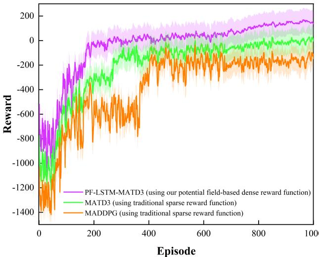  
Fig. 11. Episode reward curves of MADDPG, MATD3 and PF-LSTMMATD3.

TABLE IV TRAJECTORY LENGTH COMPARISON   

<html><body><table><tr><td>Algorithm</td><td>UAV</td><td>Length (km)</td><td>Total Length (km)</td></tr><tr><td>MATD3</td><td>UAVF1 UAVL UAVF2</td><td>8.5876 8.3315 8.2575</td><td>25.1766</td></tr><tr><td>PF-LSTM-MATD3</td><td>UAVF1 UAVL UAVF2</td><td>8.3388 8.2512 8.2460</td><td>24.8360</td></tr></table></body></html>

TABLE V SETTINGS OF THE MULTI-UAV FORMATION   

<html><body><table><tr><td>UAV</td><td>Starting position (km)</td><td>Target position (km)</td></tr><tr><td>UAVF1</td><td>(2.9,1)</td><td>(10,1,1.5)</td></tr><tr><td>UAVL</td><td>(3.9,1)</td><td>(11,1,1.5)</td></tr><tr><td>UAVF2</td><td>(2.5,9.866,1)</td><td>(10.5,1,866,1.5)</td></tr></table></body></html>

TABLE VI SETTINGS OF THE OBSTACLES   

<html><body><table><tr><td>Obstacle</td><td>Center position in XY-plane (km)</td><td>Radius (km)</td></tr><tr><td>Sphere-1</td><td>(3,7,0)</td><td>1.5</td></tr><tr><td>Cylinder-1</td><td>(5,5.0)</td><td>1.2</td></tr><tr><td>Cylinder-2</td><td>(7,7,0)</td><td>1.2</td></tr></table></body></html>

$$
y _ { i } ^ { q } = r _ { i } + \gamma \operatorname* { m i n } _ { k = 1 , 2 } Q ^ { \prime } ( o ^ { \prime q } , a ^ { q } ; w _ { i . k } ^ { \prime } )
$$

The sampling process adopts a prioritized experience replay mechanism [38], i.e., samples with larger Q-value estimation errors are picked preferentially to improve training efficiency. The probability of UAV sampling $q$ is

$$
P _ { i } ^ { q } = \frac { ( p _ { i } ^ { q } ) ^ { \alpha } } { \sum _ { \chi = 1 } ^ { D _ { S } } { ( p _ { i } ^ { \chi } ) } ^ { \alpha } }
$$

where $D _ { S }$ is the number of samples in current experience replay buffer, $p _ { i } ^ { q }$ is the priority of $q$ , $\alpha \in [ 0 , 1 ]$ is used to adjust the

priority. In this article, $p _ { i } ^ { q }$ is

$$
p _ { i } ^ { q } = \operatorname* { m a x } \left( \left| y _ { i } ^ { q } - Q ( o ^ { q } , a ^ { q } ; w _ { i . 1 } ) \right| , \left| y _ { i } ^ { q } - Q ( o ^ { q } , a ^ { q } ; w _ { i . 2 } ) \right| \right)
$$

where $\left| y _ { i } ^ { q } - Q ( o ^ { q } , a ^ { q } ; w _ { i . 1 } ) \right|$ and $| y _ { i } ^ { q } - Q ( o ^ { q } , a ^ { q } ; w _ { i . 2 } ) |$ are tem( ; )poral difference errors of sample $q$ ( ; )employing current critic network-1 and current critic network-2 respectively.

The actor network of $U A V _ { i }$ is updated according to

$$
\begin{array} { r } { \{ \begin{array} { l l } { L ( w _ { i \cdot k } ) = \mathrm { E } _ { o , a , r , o ^ { \prime } \sim D } [ ( Q ( o _ { i } , a _ { i } ; w _ { i \cdot k } ) - y _ { i } ) ^ { 2 } ] } \\ { w _ { i \cdot k }  w _ { i \cdot k } - \alpha ^ { Q } \nabla _ { w _ { i \cdot k } } L ( w _ { i \cdot k } ) } \end{array}  } \end{array}
$$

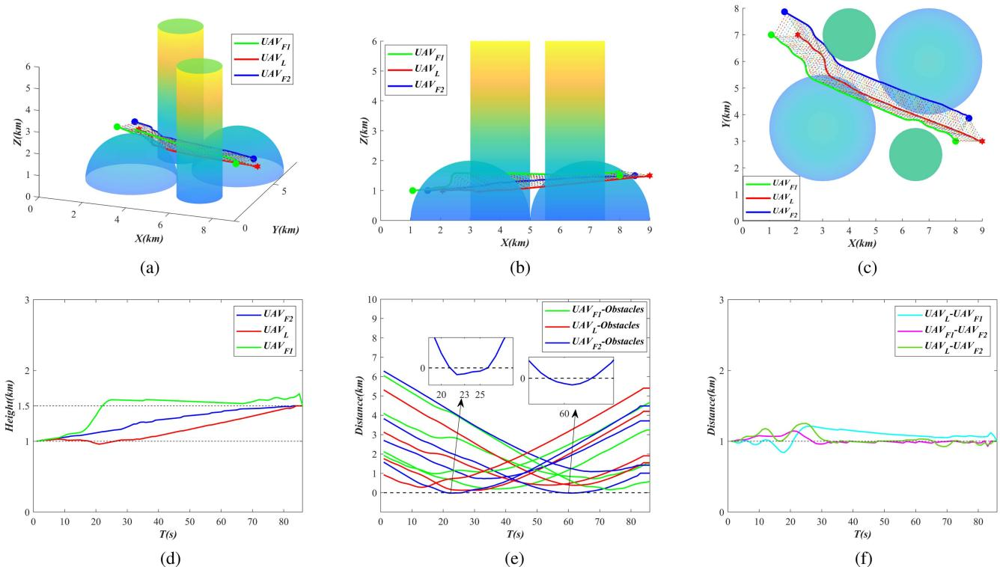  
Fig. 12. Simulation and analysis of the multi-UAV formation cooperative trajectory planning based on MADDPG. (a) 3-D view of trajectory planning. (b) XZ-plane view of trajectory planning. (c) XY-plane view of trajectory planning. (d) Flight height of UAVs. (e) Distance between each UAV and obstacles. (f) Distance between UAVs.

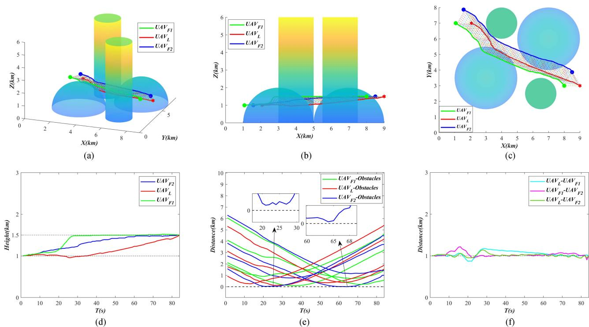  
Fig. 13. Simulation and analysis of the multi-UAV formation cooperative trajectory planning based on MATD3. (a) 3-D view of trajectory planning. (b) XZ-plane view of trajectory planning. (c) XY-plane view of trajectory planning. (d) Flight height of UAVs. (e) Distance between each UAV and obstacles. (f) Distance between UAVs.

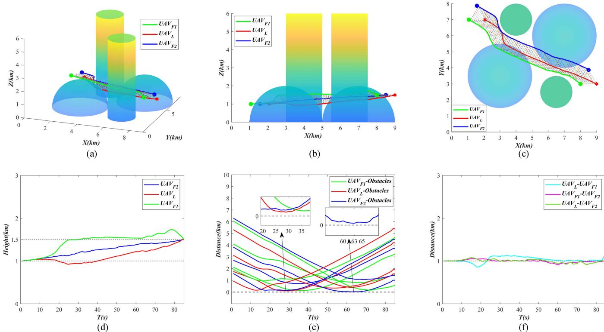  
Fig. 14. Simulation and analysis of the multi-UAV formation cooperative trajectory planning based on PF-LSTM-MATD3. (a) 3-D view of trajectory planning. (b) XZ-plane view of trajectory planning. (c) XY-plane view of trajectory planning. (d) Flight height of UAVs. (e) Distance between each UAV and obstacles. (f) Distance between UAVs.

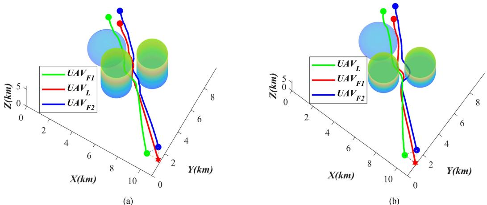  
Fig. 15. Multi-UAV formation trained by MADDPG and MATD3 respectively cannot pass through the narrow passage. (a) Multi-UAV formation trained by MADDPG fails to pass through the narrow passage. (b) Multi-UAV formation trained by MATD3 fails to pass through the narrow passage.

The critic network of $U A V _ { i }$ is updated according to

$$
\begin{array} { r } { \{ \nabla _ { \theta _ { i } } J ( \theta _ { i } ) = \mathrm { E } _ { o \sim D } [ \nabla _ { \theta _ { i } } \mu ( o _ { i } ; \theta _ { i } ) \nabla _ { a _ { i } } Q ( o _ { i } , u _ { i } ; w _ { i } ) | _ { u _ { i } = \mu ( o _ { i } ; \theta _ { i } ) } ]  } \\ {  \theta _ { i }  \theta _ { i } + \alpha ^ { \mu } \nabla _ { \theta _ { i } } J ( \theta _ { i } )  } \end{array}
$$

The target network of $U A V _ { i }$ is updated according to

$$
\left\{ \begin{array} { l l } { { \theta ^ { \prime } } _ { i } \gets \tau \theta _ { i } + ( 1 - \tau ) { \theta ^ { \prime } } _ { i } } \\ { w ^ { \prime } { } _ { i . k } \gets \tau w _ { i . k } + ( 1 - \tau ) w ^ { \prime } { } _ { i . k } } \end{array} \right.
$$

The training episode is over and the next one begins when the time step of each episode reaches a pre-set value. An optimal policy for multi-UAV formation trajectory planning is obtained once the maximum number of episodes has been reached in the training process.

# IV. SIMULATION EXPERIMENTS

In this section, the superiority of the PF-LSTM-MATD3 algorithm in policy learning, trajectory planning and formation maintaining is verified through comparison experiments with MADDPG and MATD3 algorithms. In addition, it is confirmed that the optimal policy for multi-UAV formation trajectory planning obtained by the hierarchical PF-LSTM-MATD3 training mechanism can adapt to narrow passages in unknown environments.

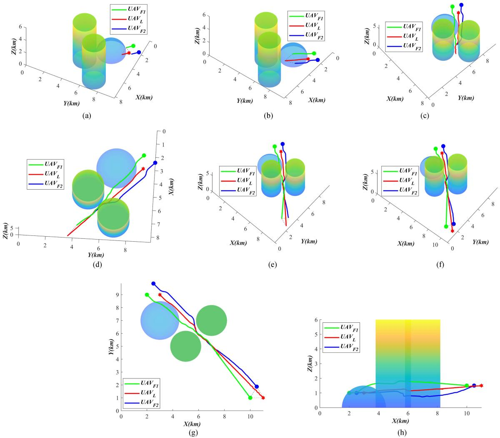  
Fig. 16. Multi-UAV formation trained by PF-LSTM-MATD3 succeeds in traversing the narrow passage. (a) $\mathrm { T } = 8$ s (three-dimensional view). (b) $\mathrm { T } = 2 5$ s (three-dimensional view). (c) $\mathrm { T } = 5 0$ s (three-dimensional view). (d) $\mathrm { T } = 7 2$ s (three-dimensional view). (e) $\mathrm { T } = 1 0 0 ~ \mathrm { s }$ (three-dimensional view). (f) $\mathrm { T } = 1 1 8$ (three-dimensional view). (g) XY-plane view of trajectory planning. (h) XZ-plane view of trajectory planning.

# A. Experiment Setting

The simulation computer configuration is as follows: CPU Intel Core i7-12700F, GPU NVIDIA GeForce RTX 3070Ti, RAM 32 GB. The hyper-parameters of the MADDPG, MATD3 and PF-LSTM-MATD3 algorithms are listed in Table I.

# B. Experiment on Algorithm Performance Comparison

In order to verify the policy learning, trajectory planning and formation maintaining and transformation performance of MADDPG, MATD3 and PF-LSTM-MATD3, it is assumed that UAVs always maintain a triangular formation in cooperative reconnaissance mission, and the desired distance between UAVs is $1 \mathrm { k m }$ whereas the narrow passage case is temporarily neglected for simplification. The multi-UAV formation settings are listed in Table II, where $U A V _ { L }$ is the virtual leader UAV, $U A V _ { F 1 }$ and $U A V _ { F 2 }$ are the follower UAVs. The settings of the obstacles constructed according to (2) are listed in Table III. During trajectory planning, the heights of all UAVs in Table II changes from $1 ~ \mathrm { k m }$ to $1 . 5 \mathrm { k m }$ and the threat radii of spherical obstacles in Table III change with the heights correspondingly.

MADDPG, MATD3 and PF-LSTM-MATD3 algorithms share the same state space and action space. Currently, there is no clear definition of the convergence of deep reinforcement learning [39], so the episode reward curves are plotted in Fig. 11 where the stability, cumulative rewards after convergence and learning speed of the training process are figured out. Both MADDPG and MATD3 are trained using the same traditional sparse reward function. Significantly, MATD3 has faster convergence, better policy learning efficiency, and higher reward after convergence under the same condition. Furthermore, as an improved MATD3 algorithm using the proposed potential filed-based dense reward function given in (29) and integrating LSTM, PF-LSTM-MATD3 performs better than the original MATD3 algorithm which uses the traditional sparse reward function. Therefore, among these three algorithms, PF-LSTMMATD3 with the proposed potential filed-based dense reward function performs best, followed by MATD3.

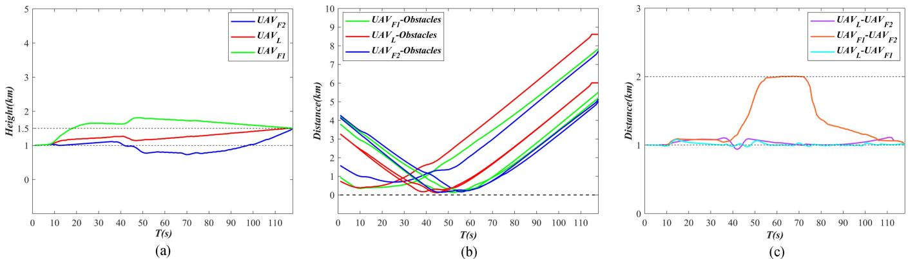  
Fig. 17. Simulation and analysis of the multi-UAV formation cooperative trajectory planning based on PF-LSTM-MATD3 in an environment with narrow passages. (a) Flight height of UAVs. (b) Distance between each UAV and obstacles. (c) Distance between UAVs.

Simulation and analysis of multi-UAV formation trajectory planning based on MADDPG, MATD3 and PF-LSTM-MATD3 are shown in Figs. 12, 13, and 14 respectively. Apparently, the trajectories planned by MATD3 and PF-LSTM-MATD3 are overall acceptable, avoid obstacles effectively and reach the goal successfully while maintaining a triangular formation. However, according to Fig. 11(e), $U A V _ { F 2 }$ in the formation trained by MADDPG fails to avoid obstacles. Therefore, MADDPG cannot be applied to the multi-UAV formation trajectory planning problem in this article.

Total trajectory length of all UAVs in the formation is used as the criteria to judge which one is better between MATD3 and PFLSTM-MATD3. The MATD3 algorithm’s total trajectory length is $2 5 . 1 7 6 6 \mathrm { k m }$ while that of PF-LSTM-MATD3 is $2 4 . 8 3 6 0 \mathrm { k m }$ as shown in Table IV. Obviously, PF-LSTM-MATD3 has a better planning performance than MATD3.

In summary, PF-LSTM-MATD3 is superior to MADDPG and MATD3 in terms of policy learning and trajectory planning in this article.

# C. Experiment on the Adaptability to Narrow Passages

In complex obstacles environment, it is necessary for PFLSTM-MATD3 to further investigate the UAVs’ ability to cooperatively traverse the narrow passages through formation transformation. i.e., the multi-UAV formation detect narrow passages in time and transform formation from triangle to linear. To improve the efficiency of the trajectory planning, one sphere and two cylinders are constructed as obstacles to simulate narrow passages according to (2). The distance between obstacles is much smaller than the width of the triangular formation which is defined in (18).

The multi-UAV formation settings are listed in Table V. And the settings of the obstacles are listed in Table VI. During trajectory planning, the heights of all UAVs in Table V also changes from $1 \mathrm { k m }$ to $1 . 5 \mathrm { k m }$ .

As shown in Fig. 15, without the proposed potential filedbased dense reward function and LSTM, the multi-UAV formation trained by MADDPG and MATD3 respectively cannot pass through the narrow passage, whereas the planned trajectory of PF-LSTM-MATD algorithm successfully avoids obstacles and passes through the narrow passage, as shown in Figs. 16 and 17. At the initial moment, the multi-UAV formation maintains a triangular formation, and the distance between any two UAVs is $1 \mathrm { k m }$ . Then the multi-UAV formation detects a narrow passage and begins to transform from the triangular formation to a linear formation. Based on the proposed adaptive formation transformation strategy in Fig. 4, the desired distance between $U A V _ { F 1 }$ and $U A V _ { L }$ is $1 ~ \mathrm { k m }$ , the desired distance between $U A V _ { F 2 }$ and $U A V _ { L }$ is $1 ~ \mathrm { k m }$ , and the desired distance between $U A V _ { F 1 }$ and $U A V _ { F 2 }$ is $2 \mathrm { k m }$ . Finally, the multi-UAV formation successfully reverts to a triangular formation.

In summary, the optimal trajectory planning policy of PFLSTM-MATD3 can preferably adapt to the narrow passage in unknown environments, making the cooperative trajectory planning of multi-UAV formation more flexible.

# V. CONCLUSION

In this article, the multi-UAV adaptive cooperative formation trajectory planning issue, including collision avoidance, trajectory planning and adaptive formation transformation strategy, has been addressed. Firstly, an improved deep reinforcement learning algorithm PF-LSTM-MATD3 is proposed. The novel algorithm employs a potential field-based dense reward function, and introduces LSTM networks into the environment perception end of MATD3 network, which accelerates the convergence and improves the policy learning efficiency. In addition, an adaptive formation maintaining and transformation strategy is presented. Finally, a hierarchical deep reinforcement learning training mechanism, including adaptive formation layer, trajectory planning layer and action execution layer, is provided to train an optimal trajectory planning policy. Compared with MADDPG and MATD3, the proposed PF-LSTM-MATD3 algorithm has the best performance in policy learning and trajectory planning. And the optimal trajectory planning policy trained by the hierarchical PF-LSTM-MATD3 training mechanism can adapt to the narrow passage in unknown environments.

REFERENCES   
[1] J. Chen, C. Du, Y. Zhang, P. Han, and W. Wei, “A clustering-based coverage path planning method for autonomous heterogeneous UAVs,” IEEE Trans. Intell. Transp. Syst., vol. 23, no. 12, pp. 25546–25556, Dec. 2022.   
[2] J. Chen et al., “Deep reinforcement learning based resource allocation in multi-UAV-aided MEC networks,” IEEE Trans. Commun., vol. 71, no. 1, pp. 296–309, Jan. 2023.   
[3] M. A. Dhuheir, E. Baccour, A. Erbad, S. S. Al-Obaidi, and M. Hamdi, “Deep reinforcement learning for trajectory path planning and distributed inference in resource-constrained UAV swarms,” IEEE Internet Things J., vol. 10, no. 9, pp. 8185–8201, May 2023.   
[4] D. Li et al., “Pseudospectral convex programming for free-floating space manipulator path planning,” Space Sci. Technol., vol. 3, 2023, Art. no. 0030.   
[5] P. Yang, X. Cao, X. Xi, W. Du, Z. Xiao, and D. Wu, “Three-dimensional continuous movement control of drone cells for energy-efficient communication coverage,” IEEE Trans. Veh. Technol., vol. 68, no. 7, pp. 6535–6546, Jul. 2019.   
[6] W. Wang, Y. Liu, R. Srikant, and L. Ying, “3M-RL: Multi-resolution, multi-agent, mean-field reinforcement learning for autonomous UAV routing,” IEEE Trans. Intell. Transp. Syst., vol. 23, no. 7, pp. 8985–8996, Jul. 2022.   
[7] S. Xu, X. Zhang, C. Li, D. Wang, and L. Yang, “Deep reinforcement learning approach for joint trajectory design in multi-UAV IoT networks,” IEEE Trans. Veh. Technol., vol. 71, no. 3, pp. 3389–3394, Mar. 2022.   
[8] L. Wang, K. Wang, C. Pan, W. Xu, N. Aslam, and L. Hanzo, “Multi-agent deep reinforcement learning-based trajectory planning for multi-UAV assisted mobile edge computing,” IEEE Trans. Cogn. Commun. Netw., vol. 7, no. 1, pp. 73–84, Mar. 2021.   
[9] J. Chen, P. Yang, S. Ren, Z. Zhao, X. Cao, and D. Wu, “Enhancing AIoT device association with task offloading in aerial MEC networks,” IEEE Internet Things J., vol. 11, no. 1, pp. 174–187, Jan. 2024.   
[10] K. Wei et al., “High-performance UAV crowdsensing: A deep reinforcement learning approach,” IEEE Internet Things J., vol. 9, no. 19, pp. 18487–18499, Oct. 2022.   
[11] A. Singla, S. Padakandla, and S. Bhatnagar, “Memory-based deep reinforcement learning for obstacle avoidance in UAV with limited environment knowledge,” IEEE Trans. Intell. Transp. Syst., vol. 22, no. 1, pp. 107–118, Jan. 2021.   
[12] U. Challita, W. Saad, and C. Bettstetter, “Interference management for cellular-connected UAVs: A deep reinforcement learning approach,” IEEE Trans. Wireless Commun., vol. 18, no. 4, pp. 2125–2140, Apr. 2019.   
[13] D. Wang, T. Fan, T. Han, and J. Pan, “A two-stage reinforcement learning approach for multi-UAV collision avoidance under imperfect sensing,” IEEE Robot. Autom. Lett., vol. 5, no. 2, pp. 3098–3105, Apr. 2020.   
[14] X. Wang and M. C. Gursoy, “Learning-based UAV trajectory optimization with collision avoidance and connectivity constraints,” IEEE Trans. Wireless Commun., vol. 21, no. 6, pp. 4350–4363, Jun. 2022.   
[15] S. Gong, M. Wang, B. Gu, W. Zhang, D. T. Hoang, and D. Niyato, “Bayesian optimization enhanced deep reinforcement learning for trajectory planning and network formation in multi-UAV networks,” IEEE Trans. Veh. Technol., vol. 72, no. 8, pp. 10933–10948, Aug. 2023.   
[16] W. Hu et al., “Multi-UAV coverage path planning: A distributed online cooperation method,” IEEE Trans. Veh. Technol., vol. 72, no. 9, pp. 11727–11740, Sep. 2023.   
[17] R. Jiang, D. Ye, Y. Xiao, Z. Sun, and Z. Zhang, “Orbital interception pursuit strategy for random evasion using deep reinforcement learning,” Space Sci. Technol., vol. 3, 2023, Art. no. 0086.   
[18] Y. Cao, X. Cheng, and J. Mu, “Concentrated coverage path planning algorithm of UAV formation for aerial photography,” IEEE Sensors J., vol. 22, no. 11, pp. 11098–11111, Jun. 2022.   
[19] Z. Pan, C. Zhang, Y. Xia, H. Xiong, and X. Shao, “An improved artificial potential field method for path planning and formation control of the multiUAV systems,” IEEE Trans. Circuits Syst. II, Exp. Briefs, vol. 69, no. 3, pp. 1129–1133, Mar. 2022.   
[20] X. Wu, B. Xiao, C. Wu, and Y. Guo, “Centroidal voronoi tessellation and model predictive control–based macro-micro trajectory optimization of microsatellite swarm,” Space Sci. Technol., vol. 2022, 2022, Art. no. 9802195.   
[21] G. Fontanesi, A. Zhu, M. Arvaneh, and H. Ahmadi, “A transfer learning approach for UAV path design with connectivity outage constraint,” IEEE Internet Things J., vol. 10, no. 6, pp. 4998–5012, Mar. 2023.   
[22] M. Petrlik, T. Baca, D. Hert, M. Vrba, T. Krajnik, and M. Saska, “A robust UAV system for operations in a constrained environment,” IEEE Robot. Autom. Lett., vol. 5, no. 2, pp. 2169–2176, Apr. 2020.   
[23] G. Raja, S. Essaky, A. Ganapathisubramaniyan, and Y. Baskar, “Nexus of deep reinforcement learning and leader-follower approach for AIoT enabled aerial networks,” IEEE Trans. Ind. Informat., vol. 19, no. 8, pp. 9165–9172, Aug. 2023.   
[24] G.-P. Liu and S. Zhang, “A survey on formation control of small satellites,” Proc. IEEE, vol. 106, no. 3, pp. 440–457, Mar. 2018.   
[25] S. Ruan, K. L. Poblete, H. Wu, Q. Ma, and G. S. Chirikjian, “Efficient path planning in narrow passages for robots with ellipsoidal components,” IEEE Trans. Robot., vol. 39, no. 1, pp. 110–127, Feb. 2023.   
[26] L. Cao, B. Xiao, M. Golestani, and D. Ran, “Faster fixed-time control of flexible spacecraft attitude stabilization,” IEEE Trans. Ind. Informat., vol. 16, no. 2, pp. 1281–1290, Feb. 2020.   
[27] B. Xiao, X. Wu, L. Cao, and X. Hu, “Prescribed time attitude tracking control of spacecraft with arbitrary disturbance,” IEEE Trans. Aerosp. Electron. Syst., vol. 58, no. 3, pp. 2531–2540, Jun. 2022.   
[28] Y. Xun, “Research on mission planning for the multi-UAV in complex constraints environment” M.S. thesis, Sch. Automat., Northwestern Polytechnical Univ., Xi’an, China, Jan. 2021.   
[29] Y. Xue and W. Chen, “A UAV navigation approach based on deep reinforcement learning in large cluttered 3D environments,” IEEE Trans. Veh. Technol., vol. 72, no. 3, pp. 3001–3014, Mar. 2023.   
[30] J. J. Park, J. H. Moon, K.-Y. Lee, and D. I. Kim, “Transmitter-oriented dualmode SWIPT with deep-learning-based adaptive mode switching for IoT sensor networks,” IEEE Internet Things J., vol. 7, no. 9, pp. 8979–8992, Sep. 2020.   
[31] C. Wang, J. Wang, Y. Shen, and X. Zhang, “Autonomous navigation of UAVs in large-scale complex environments: A deep reinforcement learning approach,” IEEE Trans. Veh. Technol., vol. 68, no. 3, pp. 2124–2136, Mar. 2019.   
[32] A. Ferdowsi, M. A. Abd-Elmagid, W. Saad, and H. S. Dhillon, “Neural combinatorial deep reinforcement learning for age-optimal joint trajectory and scheduling design in UAV-assisted networks,” IEEE J. Sel. Areas Commun., vol. 39, no. 5, pp. 1250–1265, May 2021.   
[33] X. Gao, L. Yan, Z. Li, G. Wang, and I.-M. Chen, “Improved deep deterministic policy gradient for dynamic obstacle avoidance of mobile robot,” IEEE Trans. Syst., Man, Cybern., Syst., vol. 53, no. 6, pp. 3675–3682, Jun. 2023.   
[34] T. Hickling, N. Aouf, and P. Spencer, “Robust adversarial attacks detection based on explainable deep reinforcement learning for UAV guidance and planning,” IEEE Trans. Intell. Veh., vol. 8, no. 10, pp. 4381–4394, Oct. 2023.   
[35] C. H. Liu, X. Ma, X. Gao, and J. Tang, “Distributed energy-efficient multi-UAV navigation for long-term communication coverage by deep reinforcement learning,” IEEE Trans. Mobile Comput., vol. 19, no. 6, pp. 1274–1285, Jun. 2020.   
[36] S. Li, F. Wu, S. Luo, Z. Fan, J. Chen, and S. Fu, “Dynamic online trajectory planning for a UAV-enabled data collection system,” IEEE Trans. Veh. Technol., vol. 71, no. 12, pp. 13332–13343, Dec. 2022.   
[37] M. Goudarzi, M. Palaniswami, and R. Buyya, “A distributed deep reinforcement learning technique for application placement in edge and fog computing environments,” IEEE Trans. Mobile Comput., vol. 22, no. 5, pp. 2491–2505, May 2023.   
[38] X. Tao and A. S. Hafid, “DeepSensing: A novel mobile crowdsensing framework with double deep Q-network and prioritized experience replay,” IEEE Internet Things J., vol. 7, no. 12, pp. 11547–11558, Dec. 2020.   
[39] W. Wang, L. Wang, J. Wu, X. Tao, and H. Wu, “Oracle-guided deep reinforcement learning for large-scale multi-UAVs flocking and navigation,” IEEE Trans. Veh. Technol., vol. 71, no. 10, pp. 10280–10292, Oct. 2022.

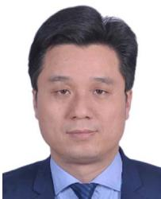

Xiaojun Xing received the B.S. degree from the School of Power and Energy, Northwestern Polytechnical University, Xi’an, China, in 1999, and the B.S. and Ph.D. degrees in control theory and control engineering from Northwestern Polytechnical University, Xi’an, China, in 2002 and 2008, respectively. He is currently an Associate Professor with the School of Automation, Northwestern Polytechnical University. His research interests include flight control and guidance, navigation, and control of unmanned aerial/ground vehicles.

Zhiwei Zhou received the B.S. degree in automation from Chang’an University, Xi’an, China, in 2021. He is currently working toward the M.S. degree in control science and engineering with Northwestern Polytechnical University, Xi’an, China. His research interests include aircraft flight control and multi-UAV trajectory planning based on deep reinforcement learning.

Bing Xiao (Member, IEEE) received the B.S. degree in mathematics from Tianjin Polytechnic University, Tianjin, China, in 2007, and the M.S. and Ph.D. degrees in control science and engineering from the Harbin Institute of Technology, Harbin, China, in 2010 and 2014, respectively. He is currently a Professor with the School of Automation, Northwestern Polytechnical University. His research interests include aircraft control, advanced control design, and its application to unmanned aerial vehicles.

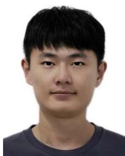

Yan Li received the M.S. degree in electronic information from Northwestern Polytechnical University, Xi’an, China, in 2023.

Yilin Xun received the M.S. degree in control engineering from Northwestern Polytechnical University, Xi’an, China, in 2021.